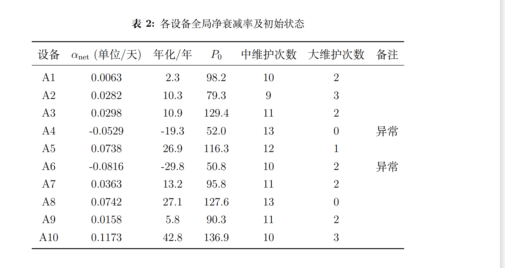
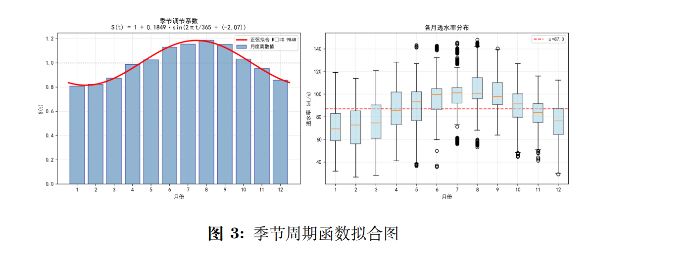
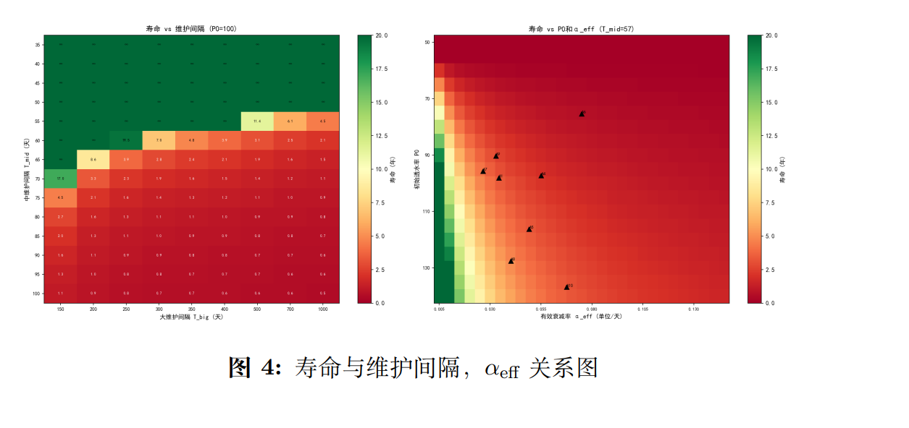
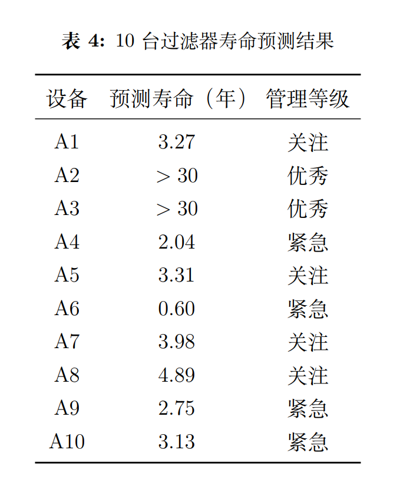
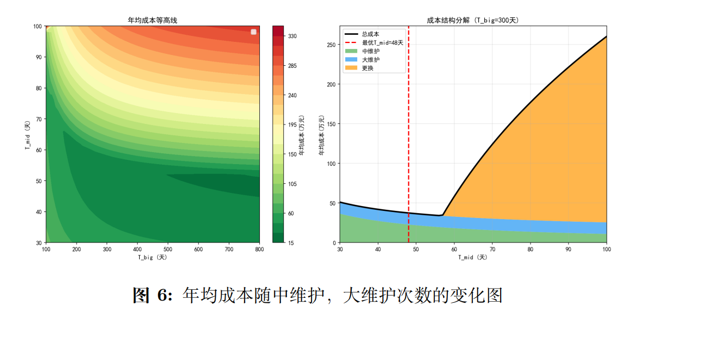
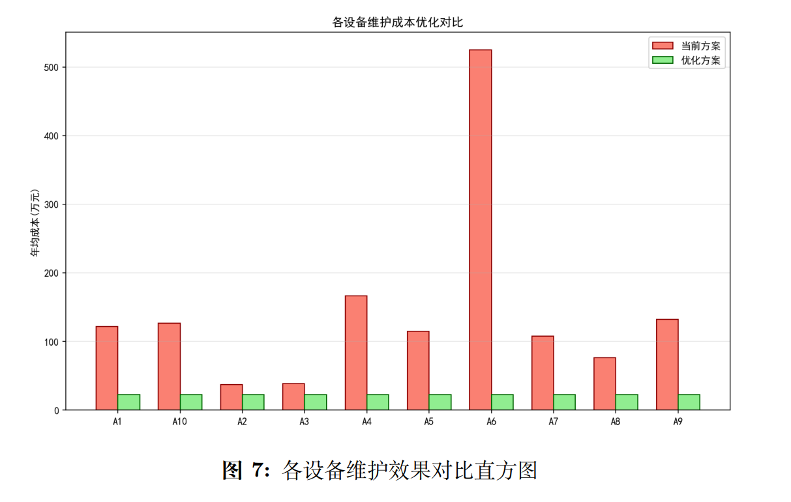
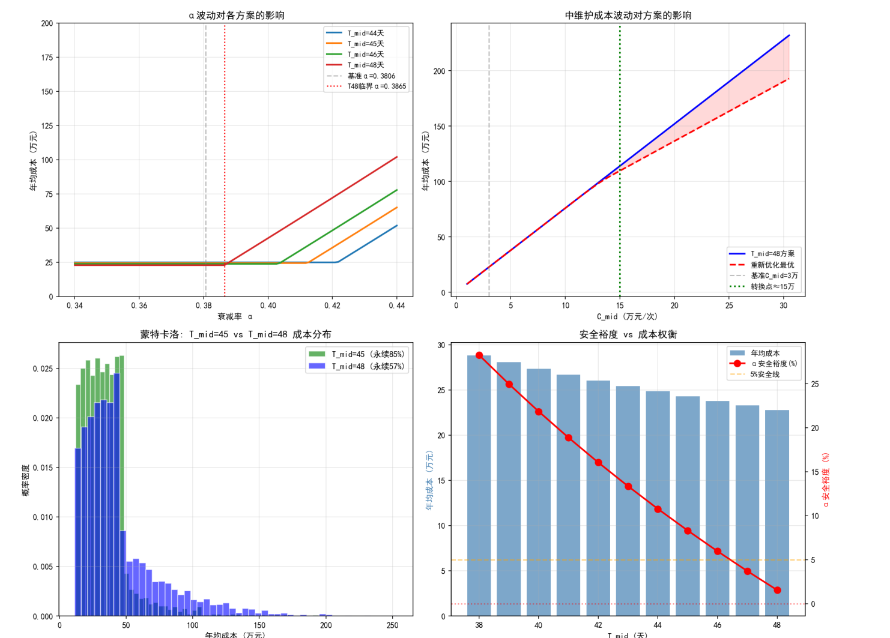

# 工业污水过滤设备透水率衰减模型与最优维护策略

### 参赛团队: [宋佳熹 程康乐 侯世怀]
*[2026年北京师范大学数学建模竞赛]*

 
 

---

## 🌍 全局概览 (Overview)

**我们解决了一个什么问题？**
在现代工厂中，工业污水过滤设备是不可或缺的环保核心。然而，随着设备的持续运行，污物附着与自然老化会导致其“透水率”（即过滤效率）不断下降。为了维持运转，工厂必须定期停机进行维护（分为中维护和大维护），甚至直接花重金更换新机器。

**核心痛点在于：** * 维护得太频繁，虽然机器寿命长了，但每年维护费极高。
* 维护得太少，机器很容易彻底报废，几百万的更换成本让人难以承受。

**本项目的核心贡献：**
我们不依赖经验瞎猜，而是完全基于历史运行数据，构建了一套**透水率动力学模型**。通过运筹优化与蒙特卡洛模拟，我们为工厂量身定制了一套“花钱最少、风险最低、且能让机器永远不坏”的最佳维护排班表。

---

## 🔬 一、 如何量化设备的衰老？（透水率加乘混合动力模型）

要制定策略，首先得弄清楚透水率到底是怎么变化的。我们没有直接套用现成的黑盒模型，而是从杂乱的数据中拆解出了**三大核心物理特征**：

1. **长期趋势（老去）：** 设备随时间推移，透水性能呈线性下滑。我们使用了 Theil-Sen 鲁棒回归来精准测算设备的自然衰减率 $k$。

> **👇 图2：设备自然衰减率 (K) 的计算与拟合过程**

2. **季节波动（起伏）：** 受气温影响，夏季透水率高，冬季透水率低，呈现出类似波浪的周期性。

> **👇 图3：透水率的季节周期性变化特征**

3. **维护跳跃（回血与暗伤）：** 每次清洗维护会让透水率瞬间飙升，但“大维护”力度过猛，会给机器造成不可逆的永久损伤。基于此，我们推导出如下动力学模型：

$$P(t)=[P_{0}-k\cdot t-\alpha\cdot N_{L}(t)]\cdot S(t)+\Delta_{M}\cdot N_{M}(t)+\Delta_{L}\cdot N_{L}(t)$$

> **👇 图1：中/大维护对透水率的即时恢复量 (ΔM) 与损伤拟合**

---

## ⏳ 二、 机器到底什么时候算报废？（修正解析寿命预测）

有了动力学模型，我们需要预测这 10 台设备的剩余寿命。

传统观念认为，只要某天透水率跌破红线（37），机器就废了。但这不符合现实：因为冬季透水率本来就低。因此，我们定义了更科学的工程失效准则：**只有在冬季连续 30 天平均透水率低于 37，才判定为彻底报废**。

同时，我们创新性地定义了**“有效衰减率 ($\alpha_{eff}$)”**，将离散的维护效果平摊到每一天。

> **👇 图4：预测寿命与维护间隔及有效衰减率的二维关系**

**核心寿命预测结果：**
在现有的高频维护下，有 8 台设备寿命在 0.60 ~ 4.89 年之间，而有 2 台设备竟然实现了**“永续运行”（寿命>30年）**！这启发了我们：只要维护频率找得准，“长生不老”在工程上是完全可行的。

> **👇 图5：10台设备在当前策略下的推荐寿命评估**

---

## 💰 三、 寻找省钱的最优解（网格搜索优化）

在明确了衰减规律和寿命边界后，我们进入核心任务：求解中维护 ($T_{mid}$) 和大维护 ($T_{big}$) 的最佳间隔天数，让年均总成本最低。

我们建立了一个带约束的运筹优化模型。将 300万的新机购置费、3万的中维护费、12万的大维护费全部纳入全生命周期分摊。由于这是一个二维寻优问题，我们采用了**网格搜索法**遍历所有可能的天数组合。

> **👇 图6：二维网格搜索——年均成本随中/大维护频率的等高线变化**

**最终斩获的理论最优解：**
* **决策：** 中维护间隔定为 **48天**，**直接取消大维护**。
* **惊人战绩：** 仅仅调整了维护节奏，10台设备全部进入“永续运行”状态。单台设备的年均成本从最高的 524万 断崖式暴跌，统一固定在 **22.81万元/年**！

> **👇 图7：方案优化前后，各设备运维成本的显著对比**

---

## 🛡️ 四、 现实世界没有理想态（基于蒙特卡洛的稳健策略）

数学模型是完美的，但现实工厂是残酷的。

我们发现，前面算出的“48天最优方案”极其极限——它的安全裕度仅有 **1.5%**。这意味着，如果工人在清洗时没洗干净，或者机器老化速度快了 2%，整个“永续运行”的条件就会崩塌。

为此，我们引入了成本与物理参数的随机波动，进行了 3000 次蒙特卡洛模拟。

> **👇 图8：不同维护策略下的蒙特卡洛成本分布与风险评估**

**我们的终极工程建议：退一步海阔天空**
我们将中维护间隔收紧 3 天，调整为 **45 天**。
* 虽然每年的维护费多花了 1.5 万元（成本增加 6.7%）。
* 但换来的是安全裕度飙升至 8.3%，永续运行的概率由 57.2% 提高到了 **85.5%**。

在真实的工业管理中，这种用微小成本换取巨大确定性的方案，才是真正敢落地、能落地的“完美策略”。
